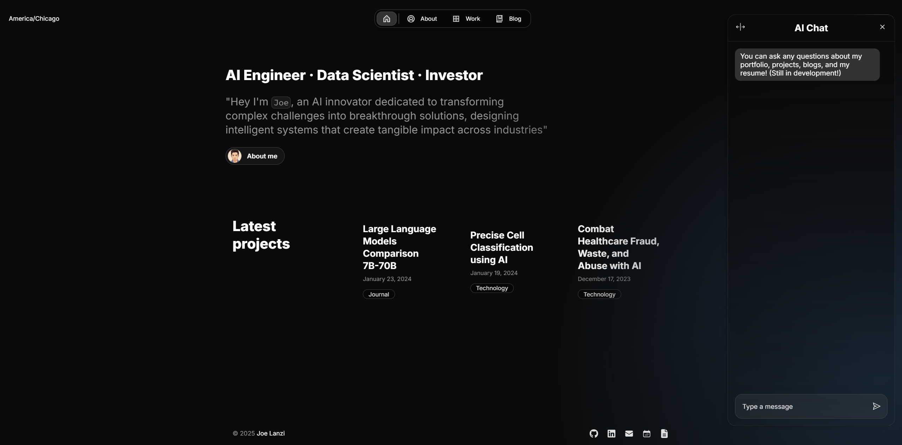

# **AI-Powered Portfolio Template with Next.js**

A modern, customizable portfolio template featuring an OpenAI-powered chat assistant that can answer questions about your work and experience. Built with Next.js and Once UI, this template includes basic security features to prevent abuse.

**100% Free for Personal Use**: Deploy on Vercel's free tier with minimal configuration. The AI integration uses pay-as-you-go OpenAI API (typically just cents/month for personal portfolios).

**Live Demo**: [View Portfolio Example](https://joelanzi.vercel.app/)



## **Quick Start**

```bash
# Clone the repository
git clone https://github.com/JoeLanzi/portfolio.git

# Install dependencies
npm install

# Set up environment variables (copy from .env.example)
cp .env.example .env

# Run development server
npm run dev
```

## **Core Features**

- 💻 **Modern Portfolio** - Built with Next.js and Once UI
- 🤖 **AI Chat Assistant** - Vector search-enabled with OpenAI Response API
- 📝 **Blog & Projects** - Simple MDX file management
- 🎨 **Easy Customization** - Configuration-based styling
- 🚀 **Vercel Ready** - Integrated Speed Insights and Analytics for seamless deployment

## **Basic Customization**

1. **Configuration**: Edit files in `src/app/resources/config`
2. **Content**: Modify content in `src/app/resources/content`
3. **Favicon**: Replace `favicon.ico` in the `src` directory
4. **Images**: Update files in `public/images` directory
5. **Resume**: Update files in `public` directory
6. **Blog Posts/Projects**: Add `.mdx` files to `src/app/blog/posts` or `src/app/work/projects`

## **AI Chat Feature**

### Overview
The portfolio includes an advanced AI chat assistant built on top of [OpenAI's Response API](https://platform.openai.com/docs/api-reference/responses) (released March 2025). This implementation:
- Leverages built-in tools including web search and file search capabilities
- Implements a complete chat interface with multi-turn conversation handling
- Uses vector database search for retrieving portfolio information
- Provides streaming responses for better user experience
- Includes optional web search capability for answering general questions

### Requirements
- OpenAI API key with access to the Response API (pay-as-you-go)
- Vector store ID for document retrieval
- Public API key for frontend-backend authentication

### Setup Instructions

1. **OpenAI API Setup**
   - If you're new to OpenAI API, [sign up for an account](https://platform.openai.com/signup)
   - Follow the [Quickstart guide](https://platform.openai.com/docs/quickstart?api-mode=responses) to retrieve your API key
   - Add your key to the `.env` file as `OPENAI_API_KEY`
   - **Cost Information**: 
     - The API uses a pay-as-you-go model that typically costs only cents to dollars depending on usage
     - This repo is configured to use GPT-4o mini by default to minimize costs
     - See [OpenAI's API pricing](https://openai.com/api/pricing/) for detailed pricing information

2. **Vector Store Setup**
   - Create a vector store with your portfolio content using OpenAI's vector database
   - Follow my detailed guide at [JoeLanzi/vector-store](https://github.com/JoeLanzi/vector-store)
   - Once created, copy your vector store ID to the `.env` file as `VECTOR_STORE_ID`

3. **API Key Setup**
   - Generate a random string to use as your `API_KEY` (can use any UUID generator)
   - This key serves as the JWT secret for secure authentication
   - Add this key to your `.env` file

4. **Environment Configuration**
   ```
   # Required in your .env file
   OPENAI_API_KEY=your_openai_api_key_here
   VECTOR_STORE_ID=your_vector_store_id_here
   API_KEY=your_public_api_key_here
   ```

5. **Enable/Disable Chat**
   - Toggle feature in `src/app/resources/config.js` with the `display.aichat` property

6. **Customization Options**
   - Change AI model in `api/config/constants.ts`
   - Modify initial greeting message
   - Customize the system prompt (DEVELOPER_PROMPT) to match your portfolio's context and style
   - Add your domain to `ALLOWED_ORIGINS` in `api/config/constants.ts` to control API access
   - Enable/configure web search tool in the `route.ts` file
   - Adjust API endpoints as needed

### Additional Resources
These are my repositories that provide detailed explanations and example implementations:

- [JoeLanzi/openai-responses-starter-app](https://github.com/JoeLanzi/openai-responses-starter-app) - Complete example app using Response API with web search and file search tools
- [JoeLanzi/vector-store](https://github.com/JoeLanzi/vector-store) - Step-by-step guide for setting up vector search with your content

These resources will help you understand how the AI chat works and how to set up everything correctly for your own implementation.

## **Vercel Deployment**

This project comes pre-configured for seamless deployment on Vercel's free tier:

1. **One-Click Deploy**
   - Fork this repository
   - Go to [vercel.com](https://vercel.com) and create an account (sign up with GitHub for easier integration)
   - Click "Add New Project" and select your forked repository
   - Vercel will automatically detect Next.js and configure the build settings

2. **Environment Variables**
   - After initial deployment, go to your project settings
   - Navigate to the "Environment Variables" section
   - Add the same variables from your `.env` file:
     ```
     OPENAI_API_KEY=your_openai_api_key_here
     VECTOR_STORE_ID=your_vector_store_id_here
     API_KEY=your_public_api_key_here
     ```

3. **Speed Insights & Analytics**
   - The project includes Vercel's Speed Insights and Analytics integration
   - Access these features from your Vercel dashboard to monitor performance and user behavior
   - No additional setup required - they work automatically after deployment

4. **Automatic Deployments**
   - Any commits pushed to your main branch will trigger automatic redeployment
   - Preview deployments are created for pull requests
   - Configure branch settings in your Vercel project settings

5. **Free Tier Benefits**
   - Unlimited personal projects
   - Free custom domain connection
   - Global CDN deployment
   - Automatic HTTPS
   - No credit card required

## **Security Features**

- **Rate Limiting**: Protects API endpoints from excessive requests
- **Token Authentication**: Secure, time-limited access tokens for API requests
- **Request Validation**: Validates request origins and authenticates all API calls
- **Secure Environment Variables**: Sensitive keys stored server-side and never exposed to clients
- **Protected Routes**: Password protection available for sensitive portfolio sections

### Rate Limiting Implementation

The portfolio implements a serverless-friendly rate limiting approach. Each serverless instance maintains its own rate counter and temporarily blocks IPs that exceed limits until the instance is recycled. This creates a pragmatic "cooling-off period" for abusive traffic while allowing legitimate users to access your site. This approach provides effective protection during high-traffic periods without requiring complex databases or permanent IP bans—striking the right balance between security and simplicity for a personal portfolio.

This security measures implement what experts call "economic disincentive" - making the effort required to attack exceed any potential gain. 

### Additional Protection

If you're concerned about OpenAI API costs, consider setting usage caps in your OpenAI dashboard as an additional safeguard against unexpected charges. This creates a hard limit that prevents excessive API usage regardless of other security measures.

## **Technical Details**

- **Framework**: Next.js (requires Node.js v18.17+)
- **UI System**: [Once UI](https://once-ui.com)
- **Original Template**: [Magic Portfolio](https://github.com/once-ui-system/magic-portfolio.git)
- **AI Model**: GPT-4o mini (optimized for cost efficiency)

- **React** - UI library
- **OpenAI SDK** - AI integration
- **React-Markdown** - Markdown rendering
- **Zustand** - State management for AI chat
- **MDX** - For blog and project content

## **License**

Distributed under the CC BY-NC 4.0 License.
- Commercial usage is not allowed
- Attribution is required

See `LICENSE.txt` for more information.