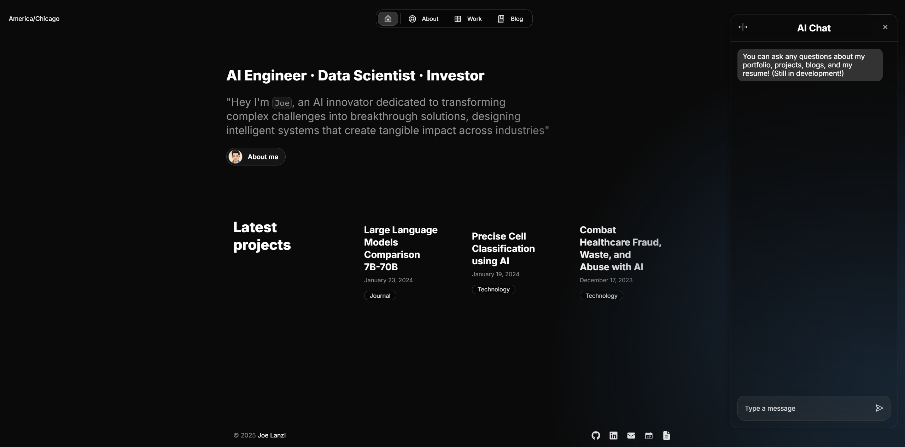

# AI-Powered Portfolio Template with Next.js

A modern, customizable portfolio template with an OpenAI-powered chat assistant that can answer questions about your work, resume, blog posts, and project pages. Built with Next.js and Once UI.

This version keeps the backend simple:

- No extra retrieval infrastructure
- No extra database
- No paid infrastructure besides OpenAI usage
- Context comes from your portfolio content, project/blog MDX, and an optional resume context file

Live demo: [joelanzi.com](https://joelanzi.com/)



## Quick Start

```bash
git clone https://github.com/JoeLanzi/portfolio.git
cd portfolio
npm install
cp .env.example .env
npm run dev
```

## Core Features

- Modern portfolio built with Next.js and Once UI
- OpenAI chat assistant powered by the Responses API
- Blog and project content managed with MDX
- Resume-aware chat grounded in local site content
- Vercel-ready deployment

## Basic Customization

1. Edit site settings in `src/app/resources/config.js`
2. Edit portfolio content in `src/app/resources/content.js`
3. Replace images in `public/images`
4. Replace `public/resume.pdf`
5. Update `public/resume-context.md`
6. Add blog posts in `src/app/blog/posts`
7. Add project pages in `src/app/work/projects`

## AI Chat

### How It Works

The chat backend uses the OpenAI Responses API and builds context from:

- `src/app/resources/content.js`
- blog post MDX files
- project MDX files
- `public/resume-context.md`
- the page the visitor is currently viewing

For follow-up turns, it uses `previous_response_id` so it does not need to resend the full conversation history every time.

### Requirements

- `OPENAI_API_KEY`
- Optional `PORTFOLIO_CONTEXT_URL` if you want to load extra context from a local public file or a remote Markdown/JSON file

### Environment Variables

```env
OPENAI_API_KEY=your_openai_api_key_here
OPENAI_MODEL=gpt-5.4-nano
OPENAI_REASONING_EFFORT=low
PORTFOLIO_CONTEXT_URL=/resume-context.md
```

### Recommended Setup

The simplest setup is:

- Keep your PDF at `public/resume.pdf`
- Keep your AI summary/context at `public/resume-context.md`
- Set `PORTFOLIO_CONTEXT_URL=/resume-context.md`

If you want to update resume context without redeploying, point `PORTFOLIO_CONTEXT_URL` to a raw GitHub or Gist URL instead.

### Customization Points

- Model and reasoning: `src/app/api/server-config.ts`
- Streaming backend route: `src/app/api/routes/stream-response/route.ts`
- Context assembly: `src/app/api/lib/context.ts`
- Client chat request flow: `src/app/api/hooks/useChat.ts`

`OPENAI_REASONING_EFFORT` supports: `none`, `minimal`, `low`, `medium`, `high`, `xhigh`.

## Vercel Deployment

1. Import the repo into Vercel
2. Add your environment variables
3. Deploy

Suggested Vercel env vars:

```env
OPENAI_API_KEY=your_openai_api_key_here
OPENAI_MODEL=gpt-5.4-nano
OPENAI_REASONING_EFFORT=low
PORTFOLIO_CONTEXT_URL=/resume-context.md
```

## Security Notes

The project includes:

- API rate limiting through middleware
- Origin validation for chat requests
- Server-side storage of OpenAI credentials

If you want stronger abuse protection, add one of:

- Vercel Bot Protection
- Cloudflare Turnstile
- stronger external rate limiting

You should also set usage caps in your OpenAI dashboard.

## Technical Stack

- Next.js
- React
- TypeScript
- OpenAI SDK
- React Markdown
- Zustand
- MDX
- Once UI

## Notes

- The chat is designed to be concise by default
- The backend is intentionally simple and maintainable
- The resume context file is meant to be edited by hand without needing a CMS

## License

Distributed under the CC BY-NC 4.0 License.

- Commercial usage is not allowed
- Attribution is required
